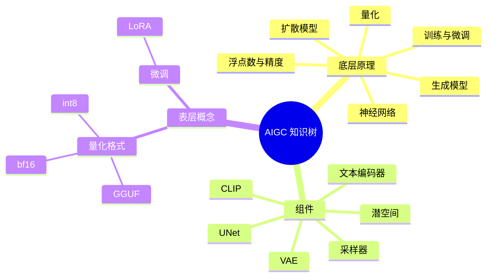

  <h1>AIGC 术语知识库</h1>
  
一线知识的沉淀与导航站 — 开源、Wiki 式、面向大众的 AIGC 术语库

  

    📚 上限靠来源
    🧪 标准靠校验
    🤗 生态靠开放
    🔖 信任靠留痕
  

---

## 🌳 知识树

每个词条是一个节点，关系是边。从根往下读是一条完整的学习路径，从叶子跳入是速查。

## 📚 词条导航

- [底层原理 →](词条/01-底层原理/神经网络.md) — 理解一切的根
- [组件 →](词条/02-组件/UNet.md) — 模型的零件
- [表层概念 →](词条/03-表层概念/) — 具体技术/格式/参数

## 🟡 前沿雷达

机器自动扫描社区（GitHub / arXiv / 讨论）生成的热词卡，未经沉淀、先看先得。见 `雷达/` 目录。

## 📖 项目文档

| 文档 | 是什么 |
|------|--------|
| [内容规范](项目文档/CONTENT-SPEC.md) | 词条长什么样、怎么写、怎么连线、怎么校验 |
| [贡献指南](项目文档/CONTRIBUTING.md) | 四层贡献模型：读者 / 贡献者 / 维护者 / 机器 |
| [维护流程](项目文档/MAINTENANCE.md) | 审校 / 发布 / 雷达 / 升降级 / 回滚 |
| [设计定案](项目文档/DESIGN-SPEC.md) | 项目设计决策的唯一事实源 |

## ✍️ 贡献

欢迎任何人参与！提 Issue 纠错、提 PR 写词条。仓库：[TEXXXXTURE/AIGC-Terminology-Wiki](https://github.com/TEXXXXTURE/AIGC-Terminology-Wiki)
